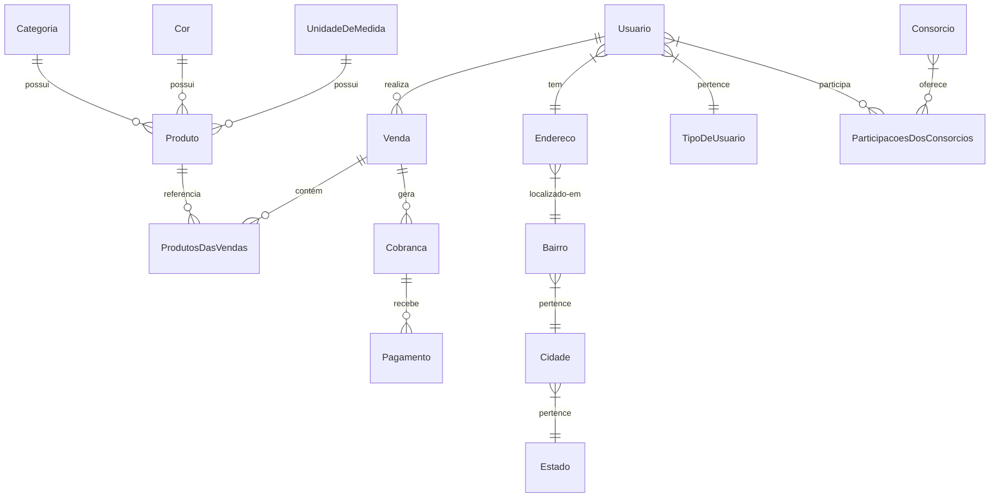

# Modelo Entidade-Relacionamento

```mermaid
erDiagram
    Categoria ||--o{ Produto : "possui"
    Cor ||--o{ Produto : "possui"
    UnidadeDeMedida ||--o{ Produto : "possui"
  
    Venda ||--o{ ProdutosDasVendas : "contém"
    Produto ||--o{ ProdutosDasVendas : "referencia"
  
    Usuario ||--o{ Venda : "realiza"
    Usuario }|--|| Endereco : "tem"
    Usuario }|--|| TipoDeUsuario : "pertence"
  
    Endereco }|--|| Bairro : "localizado-em"
    Bairro }|--|| Cidade : "pertence"
    Cidade }|--|| Estado : "pertence"
  
    Usuario }|--o{ ParticipacoesDosConsorcios : "participa"
    Consorcio }|--o{ ParticipacoesDosConsorcios : "oferece"
  
    Venda ||--o{ Cobranca : "gera"
    Cobranca ||--o{ Pagamento : "recebe"
```
