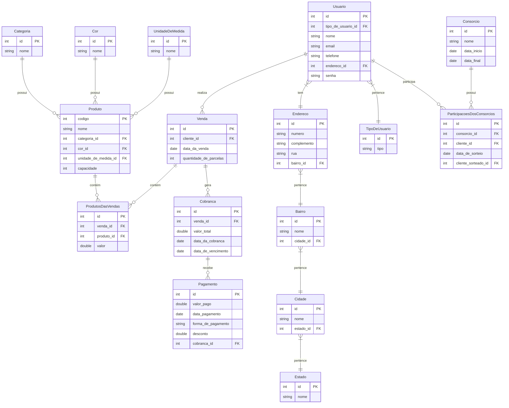

UNIVERSIDADE FEDERAL DO RIO GRANDE DO NORTE
CENTRO DE ENSINO SUPERIOR DO SERIDÓ
DEPARTAMENTO DE COMPUTAÇÃO E TECNOLOGIA
CURSO DE BACHARELADO EM SISTEMAS DE INFORMAÇÃO

# **Documento de Visão**

## **Componentes**:

EMANUEL ALVES DE MEDEIROS ` `
JUAN VITÓRIO DUTRA DE ARAÚJO ` `
MARLISON SOARES DA SILVA ` `
MATHEUS DINIZ FERNANDES ` `
MAXSUEL GADELHA OLIVEIRA DA SILVA ` `

# **Sumário**

- [**Documento de Visão**](#documento-de-visão)
  - [**Componentes**:](#componentes)
- [**Sumário**](#sumário)
- [**Descrição do Projeto**](#descrição-do-projeto)
- [**Equipe e Definição de Papéis**](#equipe-e-definição-de-papéis)
- [**Matriz de Competências**](#matriz-de-competências)
- [**Histórico de revisões**](#histórico-de-revisões)
- [**Perfis dos Usuários**](#perfis-dos-usuários)
- [**Requisitos Funcionais**](#requisitos-funcionais)
  - [Entidade Cliente - US02 - Manter Cliente](#entidade-cliente---us02---manter-cliente)
  - [Entidade Produto - US03 - Manter Produto](#entidade-produto---us03---manter-produto)
  - [Entidade Venda - US04 - Manter Venda](#entidade-venda---us04---manter-venda)
  - [Entidade Cobrança - US05 - Manter Cobrança](#entidade-cobrança---us05---manter-cobrança)
  - [Entidade Consórcio - US07 - Manter Consórcio](#entidade-consórcio---us07---manter-consórcio)
- [**Modelo Conceitual**](#modelo-conceitual)
- [**Requisitos Não-Funcionais**](#requisitos-não-funcionais)
- [**Riscos**](#riscos)

# **Descrição do Projeto**

O projeto Caderneta Virtual de Vendas (CVV) é um sistema de gerenciamento desenvolvido para um pequeno comércio que comercializa produtos domésticos da marca Tupperware. Seu objetivo é automatizar processos que antes eram realizados manualmente, aproveitando as vantagens de um software para melhorar a eficiência e reduzir erros. A proprietária enfrentava dificuldades no controle de pagamentos, especialmente no que se refere a clientes com dívidas pendentes. O sistema irá armazenar os dados cadastrais dos clientes, informações sobre os produtos à venda e o histórico de vendas. Ele também permitirá o acompanhamento detalhado dos pagamentos, com a identificação de clientes adimplentes, inadimplentes e com parcelas em aberto. Além disso, o software incluirá relatórios periódicos sobre os produtos mais vendidos, os devedores e o status de quitação das dívidas, proporcionando um controle mais eficaz do fluxo financeiro do comércio.

# **Equipe e Definição de Papéis**

| Equipe                   | Papel         |
| :----------------------- | :------------ |
| Taciano de Morais Silva  | Professor     |
| Luzineide Da Costa Silva | Cliente       |
| Emanuel Alves            | Desenvolvedor |
| Juan Vitório             | Testador      |
| Marlison Soares          | Revisor       |
| Matheus Diniz            | Analista      |
| Maxsuel Gadelha          | Líder Técnico |

# **Matriz de Competências**

| Equipe                            | Competências                              |
| :-------------------------------- | :---------------------------------------- |
| Taciano de Morais Silva           | Engenharia de Software                    |
| Emanuel Alves de Medeiros         | Desenvolvedor Django, SwiftUI.            |
| Juan Vitório Dutra de Araújo      | Designer, desenvolvedor Django, Web       |
| Marlison Soares da Silva          | Desenvolvedor Back-end, Laravel, React    |
| Matheus Diniz Fernandes           | Design, Desenvolvedor Web                 |
| Maxsuel Gadelha Oliveira da Silva | Desenvolvedor Django, React, React-Native |

# **Histórico de revisões**

| Data       | Versão | Descrição         |                                     Autor                                     |
| ---------- | ------ | ----------------- | :---------------------------------------------------------------------------: |
| 12/12/2024 | 1.0    | Documento inicial | Emanuel Alves, Juan Vitório, Marlison Soares, Matheus Diniz e Maxsuel Gadelha |

# **Perfis dos Usuários**

| **Perfil**        | **Descrição**                                                                                                                                                                                                                                                                                                                      |
| ----------------- | ---------------------------------------------------------------------------------------------------------------------------------------------------------------------------------------------------------------------------------------------------------------------------------------------------------------------------------- |
| **Administrador** | O administrador terá acesso a todas as funcionalidades envolvendo o controle de clientes, produtos, vendas, consórcios e pagamentos.                                                                                                                                                                                               |
| **Usuário**       | O usuário terá acesso a funções superficiais do sistema: terá o controle do andamento dos seus pagamentos, fiados pendentes, um histórico dos produtos comprados, a consulta de suas despesas e produtos, a visualização de seu histórico de compras, seu perfil de usuário, dentre outras funções comuns em sistemas de consulta. |

# **Requisitos Funcionais**

### Entidade Cliente - US02 - Manter Cliente

Cliente representa os consumidores da empresa, a qual necessita conte seu Nome,Cpf,Telefone e Endereço.

| Requisito                   | Descrição                                                                | Ator                   |
| --------------------------- | ------------------------------------------------------------------------ | ---------------------- |
| RF02.01 - Inserir Cliente   | Insere novo cliente informando: nome, telefone,cpf e endereço.           | Administrador,Usuário. |
| RF02.02 - Listar Clientes   | Listagem dos Clientes utilizando filtros nos atributos: Nome e endereço. | Administrador          |
| RF02.03 - Atualizar Cliente | Atualiza um Cliente informando: nome, telefone,cpf e endereço.           | Administrador,Usuário. |
| RF02.04 - Deletar Cliente   | Deleta um Cliente informando o CPF.                                      | Administrador,Usuário  |

### Entidade Produto - US03 - Manter Produto

O sistema deve manter um cadastro dos produtos ofertados.Um produto tem os atributos Código, Nome, Categoria,Cor,Descrição do produto,Tamanho e Capacidade.

| Requisito                   | Descrição                                                                                        | Ator           |
| --------------------------- | ------------------------------------------------------------------------------------------------ | -------------- |
| RF03.01 - Inserir Produto   | Insere novo Produto informando: Nome, Categoria,Cor,Descrição do produto,Tamanho e Capacidade    | Administrador. |
| RF03.02 - Listar Produtos   | Listagem dos Produtos utilizando filtros nos atributos: Nome,Categoria,Cor,Tamanho e Capacidade. | Administrador  |
| RF03.03 - Atualizar Produto | Atualiza um Produto informando: Nome, Categoria,Cor,Descrição do produto,Tamanho e Capacidade.   | Administrador. |
| RF03.04 - Deletar Produto   | Deleta um Produto informando o Código.                                                           | Administrador. |

### Entidade Venda - US04 - Manter Venda

O sistema deverá ter um manter de vendar a qual o proprietário realizará, busca, inserir novas vendas, alterar e remover vendas de produtos realizados para clientes. A venda possui atrelada a ela um usuário, a data da venda, a quantidade de parcelas e um código indentificador.

| Requisito                 | Descrição                                                                                                                                                                 | Ator                  |
| ------------------------- | ------------------------------------------------------------------------------------------------------------------------------------------------------------------------- | --------------------- |
| RF04.01 - Inserir Venda   | Insere uma nova venda informando: O usuário que está atrelado a venda, a quantidade de parcelas, o sistema irá definir a data e o código será gerado pelo banco de dados. | Administrador,Sistema |
| RF04.02 - Listar Venda    | Listagem das vendas utilizando filtros nos atributos: No nome do cliente, Data da venda , Código da Venda.                                                                | Administrador         |
| RF04.03 - Atualizar Venda | Atualiza uma venda informando: O nome do cliente, código da venda.                                                                                                        | Administrador.        |
| RF04.04 - Deletar Venda   | Deleta uma venda informando o Código.                                                                                                                                     | Administrador,        |

### Entidade Cobrança - US05 - Manter Cobrança

O sistema terá o papel de criar as cobranças com base nas vendas realizadas.

| Requisito                  | Descrição                                                                                                                                                    | Ator          |
| -------------------------- | ------------------------------------------------------------------------------------------------------------------------------------------------------------ | ------------- |
| RF05.01 - Inserir Cobrança | Com os resultados da venda feitos, será gerada uma cobrança contendo as informações da venda como as informações do cliente, da venda realizada e do produto | Sistema.      |
| RF05.02 - Listar Cobrança  | Ao mostrar uma venda específica, o sistema deve mostrar a lista de cobranças geradas para aquela venda.                                                      | Administrador |
| RF05.03 - Editar Cobrança  | Ao editar o número de parcelas, caso não tenham sido pagas cobranças, o sistema deve alterar o número de cobranças registradas para a venda                  | Administrador |

### Entidade Consórcio - US07 - Manter Consórcio

# **Modelo Conceitual**

Abaixo apresentamos o modelo conceitual utilizando o **Mermaid.**

# **Requisitos Não-Funcionais**

| Código | Nome             | Descrição                                                                                                                                                    |
| :----- | :--------------- | :----------------------------------------------------------------------------------------------------------------------------------------------------------- |
| RNF01  | Responsividade   | O design do sistema deve se adaptar a diversos tamanhos de tela, permitindo o acesso através de computadores, tablets e smartphones.                         |
| RNF02  | Segurança        | Garantir a segurança dos dados dos clientes, por meio de criptografia e controle de acesso.                                                                  |
| RNF03  | Manutenabilidade | Deve ser fácil de manter e atualizar, com um código bem estruturado e documentado, facilitando a correção de erros e implementação de novas funcionalidades. |

# **Riscos**

Preencher na tabela os riscos identificados para o início do projeto. Essa tabela deve ser atualizada ao final de cada iteração na reunião de acompanhamento.

| Data       | Risco                                                                 | Prioridade | Responsável   | Status  | Providência/Solução                                                                     |
| :--------- | :-------------------------------------------------------------------- | :--------- | :------------ | :------ | :-------------------------------------------------------------------------------------- |
| 10/03/2022 | Não aprendizado das ferramentas utilizadas pelos componentes do grupo | Alta       | Equipe        | Vigente | Reforçar estudos sobre as ferramentas e aulas com a integrante que conhece a ferramenta |
| 10/03/2022 | Ausência do cliente por qualquer motivo                               | Média      | Líder Técnico | Vigente | Planejar o cronograma tendo em base a agenda do cliente                                 |
| 10/03/2022 | Divisão de tarefas mal sucedida                                       | Baixa      | Líder Técnico | Vigente | Acompanhar de perto o desenvolvimento de cada membro da equipe.                         |
| 09/12/2024 | Atraso nas Entregas                                                   | Alto       | Equipe        | Vigente | Atraso no avanço do projeto, e na entrega das atividades que envolvam o projeto.        |
| 09/12/2024 | Desentendimento e mal relacionamento do grupo                         | Baixa      | Equipe        | Vigente | Problema relacional com o grupo, má interação e descaso no trabalho em equipe.          |
