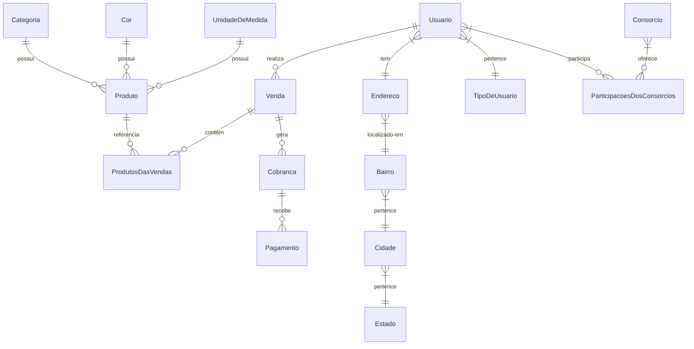

# Documento de Modelos

Neste documento temos o modelo Conceitual (UML) ou de Dados (Entidade-Relacionamento). Temos também a descrição das entidades e o dicionário de dados.

## Modelo Conceitual

### Diagrama de Classes usando Mermaid

```mermaid
classDiagram
direction RL
    class Categoria {
	    - id: int
	    - nome: char
	    +cadastrar_categoria(nome: char) : void
	    +excluir_categoria(id: int) : void
	    +editar_categoria(id: int) : void
	    +pesquisar_categoria(nome: char) : Categoria
	    +relatorio_de_categorias() : ArrayList
	    +get_nome() : char
	    +set_nome(novoNome: char) : void
	    +get_id() : int
    }

    class Cor {
	    - id: int
	    - nome: char
	    +cadastrar_cor(nome: char)
	    +excluir_cor(id: int) void
	    +editar_cor(id: int) void
	    +pesquisar_cor(nome: char) Cor
	    +relatorio_de_cores() ArrayList
	    +get_id() int
	    +get_nome() char
	    +set_nome(novoNome:char) void
    }

    class Capacidade {
	    -id: int
		-quantidade: int
	    -unidade_de_medida: char
	    +cadastrar_capacidade(nome: char) ;
	    +excluir_capacidade(id:int) void
	    +editar_capacidade(id:int) void
	    +pesquisar_medida(nome:char) UnidadeDeMedida
	    +relatorio_de_capacidades() Arraylist
	    +get_id() int
	    +get_nome() char
	    +set_nome(novoNome:char) void
    }


    class Produto {
	    -codigo: int
	    -nome: char
	    -categoria: Categoria
	    -cor: Cor
	    -capacidade: Capacidade
	    +cadastrar_produto(nome: char, codigo: int, categoria: Categoria, cor: Cor, capacidade: Capacidade) void
	    +excluir_produto(codigo: int, nome: char) void
	    +editar_produto(codigo: int, nome: char) void
	    +pesquisar_produto(codigo: int, nome: char) Produto
	    +relatorio_de_produtos() ArrayList
	    +get_codigo() int
	    +get_nome() char
	    +get_categoria() char
	    +get_cor() char
	    +get_unidade_de_medida() char
	    +get_capacidade() int
	    +set_nome(novoNome: char) void
	    +set_categoria(novaCategoria: Categoria) void
	    +set_cor(novaCor: Cor) void
	    +set_capacidade(novaCapacidade: Capacidade) void
    }

    class ProdutosDasVendas {
	    - id: int
	    - venda: Venda
	    - produto: Produto
		+ valor_total() int
	    + get_venda() Venda
	    + get_produto() Produto
	    + calcular_total_venda(valor: double) double
	    + set_venda(novaVenda: Venda) void
	    + set_produto(novoProduto: Produto) void
	    + set_valor(novo_valor: int) void
	    + cad_prods_venda(venda: Venda, produto: Produto)
	    + pesquisar_venda_dos_produtos(produto: Produto) ProdutosDasVendas
    }

    class Venda {
	    - id: int
	    - cliente: Usuario
	    - data_da_venda: Date
	    - quantidade_de_parcelas: int
	    + cadastrar_venda(cliente: Usuario, data_venda: Date, quant_parc: int) void
	    + excluir_venda(id: int, cliente: Usuario) void
	    + pesquisar_venda(id: int, cliente: Usuario) Venda
	    + editar_venda(id: int, cliente: Usuario) void
	    + relatorio_de_vendas() : ArrayList
	    + get_quantidade_de_parcelas() int
	    + calcular_parcelas(valor: double, quant_parce: int) double
	    + cliente_consulta_despesas(cliente: Usuario) ArrayList
    }

    class Usuario {
	    - id: int
	    - tipo: TipoDeUsuario
	    - nome: char
	    - email: char
	    - telefone: char
	    - endereco: Endereco
	    - senha: Password
	    + get_id() int
	    + get_nome() char
	    + get_email() char
	    + set_email(email: char) void
	    + get_telefone() char
	    + set_telefone(telefone: char) void
	    + get_senha() Password
	    + set_senha(senha: Password) void
	    + realizar_login(id: int, senha: Password) void
	    + cadastrar_usuario(nome: char, telefone: char, email: char) void
	    + excluir_usuario(id: int, nome: char) void
	    + pesquisar_usuario(id: int, nome: char) Usuario
	    + editar_usuario(id: int, nome: char) void
	    + relatorio_de_usuarios() ArrayList
    }

    class Endereco {
	    - id: int
	    - numero: char
	    - complemento: char
	    - rua: char
	    + get_nome() char
	    + get_id() int
	    + cadastrar_endereco(id: int, nome: char) void
	    + excluir_endereco(id: int) void
	    + pesquisar_endereco(id: int) Endereco
	    + editar_endereco(id: int) void
	    + relatorio_de_endereco() ArrayList
    }

    class Bairro {
	    - id: int
	    - nome: char
	    + get_nome() char
	    + get_id() int
	    + cadastrar_bairro(id: int, nome: char) void
	    + excluir_bairro(id: int) void
	    + pesquisar_bairro(nome: char) Bairro
	    + editar_bairro(id: int) void
	    + relatorio_de_bairro() ArrayList
    }

    class Cidade {
	    - id: int
	    - nome: char
	    + get_nome() char
	    + get_id() int
	    + cadastrar_cidade(id: int, nome: char) void
	    + excluir_cidade(id: int) void
	    + pesquisar_cidade(nome: char) Cidade
	    + editar_cidade(id: int) void
	    + relatorio_de_cidade() ArrayList
    }

    class Estado {
	    - id: int
	    - nome: char
	    + get_nome() char
	    + get_id() int
	    + cadastrar_estado(id: int, nome: char) void
	    + pesquisar_estado(nome: char) Estado
	    + excluir_estado(id: int) void
	    + editar_estado(id: int) void
	    + relatorio_de_estado() ArrayList
    }

    class TipoDeUsuario {
	    - id: int
	    - tipo: char
	    + cadastrar_cliente(nome: char, telefone: char, email: char) void
	    + excluir_cliente(id: int, nome: char) void
	    + pesquisar_cliente(id: int, nome: char) Cliente
	    + editar_cliente(id: int, nome: char) void
	    + relatorio_de_clientes() ArrayList
    }

    class Consorcio {
	    - id: int
	    - nome: char
	    - data_inicio: Date
	    - data_final: Date
	    + pesquisar_consorcio(nome: char) Consorcio
	    + editar_consorcio(cliente: Cliente, data_final: Date, nome: char) void
    }

    class ParticipacoesDosConsorcios {
	    - id: int
	    - consorcio: Consorcio
	    - cliente: Usuario
	    - data_de_sorteio: Date
	    - cliente_sorteado: Usuario
	    + cliente_consulta_consorcio(cliente: Usuario) consorcio
    }

    class Cobranca {
	    - id: int
	    - venda: Venda
	    - valor_total: double
	    - data_da_cobranca: Date
	    - data_de_vencimento: Date
	    + cadastrar_cobranca(venda: Venda, data_da_cobranca: Date, data_de_vencimento: Date) void
	    + excluir_cobranca(venda: Venda) void
	    + editar_cobranca(id: int) void
	    + relatorio_cobranca() ArrayList
	    + pesquisar_cobranca(venda: Venda) Cobranca
	    + get_valor() double
	    + get_venda() Venda
	    + get_data_da_cobranca() Date
	    + get_data_de_vencimento() Date
	    + valor_restante(pagamentos: Pagamento[]) double
	    + verifica_cobranca(venda: Venda, data_da_cobranca: Date, data_de_vencimento: Date) void
    }

    class Pagamento {
	    - id: int
	    - valor_pago: double
	    - data_pagamento: Date
	    - forma_de_pagamento: char
	    - desconto: double
	    - cobranca: Cobranca
	    + cadastrar_pagamento(data_pagamento: Date, forma_de_pagamento: char, desconto: double, cobranca: Cobranca) void
	    + excluir_pagamento(id: int, venda: Venda) void
	    + editar_pagamento(id: int) void
	    + pesquisar_pagamento(cobranca: Cobranca) Pagamento
	    + relatorio_pagamento() ArrayList
	    + get_data_pagamento() Date
	    + get_estado_de_pagamento() boolean
	    + get_desconto() double
	    + get_acrescimo() double
    }

    Categoria "1" -- "1..*" Produto
    Cor "1" -- "1..*" Produto
    Capacidade "1" -- "1*.." Produto
    Venda "1" -- "1..*" ProdutosDasVendas
    Produto "1" -- "1..*" ProdutosDasVendas
    Usuario "1" -- "1..*" Venda
    Endereco "1" -- "1..*" Usuario
    TipoDeUsuario "1" -- "1..*" Usuario
    Bairro "1" -- "1..*" Endereco
    Cidade "1" -- "1..*" Bairro
    Estado "1" -- "1..*" Cidade
    Usuario "1" -- "1..*" ParticipacoesDosConsorcios
    Consorcio "1" -- "1..*" ParticipacoesDosConsorcios
    Venda "1" -- "1..*" Cobranca
    Cobranca "1" -- "0..*" Pagamento
```

### Descrição das Entidades

Descrição sucinta das entidades presentes no sistema.

| Entidade               | Descrição                                                                                                                                 |
|------------------------|-------------------------------------------------------------------------------------------------------------------------------------------|
| Categoria              | Entidade para representar uma categoria de um produto. Tem as informações: id, nome.                                                    |
| Cor                    | Entidade para representar uma cor de um produto. Tem as informações: id, nome.                                                          |
| Capacidade             | Entidade para representar a capacidade de um produto. Tem as informações: id, quantidade, unidade_de_medida.                           |
| Produto                | Entidade para representar um produto. Tem as informações: código, nome, categoria, cor, capacidade.                                      |
| ProdutosDasVendas      | Entidade para representar um produto em uma venda. Tem as informações: id, venda, produto.                                              |
| Venda                  | Entidade para representar uma venda. Tem as informações: id, cliente, data da venda, quantidade de parcelas.                            |
| Usuario                | Entidade para representar um usuário (cliente). Tem as informações: id, tipo, nome, email, telefone, endereço, senha.                  |
| Endereco               | Entidade para representar um endereço. Tem as informações: id, numero, complemento, rua.                                                |
| Bairro                 | Entidade para representar um bairro. Tem as informações: id, nome.                                                                      |
| Cidade                 | Entidade para representar uma cidade. Tem as informações: id, nome.                                                                     |
| Estado                 | Entidade para representar um estado. Tem as informações: id, nome.                                                                     |
| TipoDeUsuario          | Entidade para representar o tipo de usuário. Tem as informações: id, tipo.                                                              |
| Consorcio              | Entidade para representar um consórcio. Tem as informações: id, nome, data_inicio, data_final.                                          |
| ParticipacoesDosConsorcios | Entidade para representar a participação de um usuário em um consórcio. Tem as informações: id, consorcio, cliente, data_de_sorteio. |
| Cobranca               | Entidade para representar uma cobrança. Tem as informações: id, venda, valor_total, data_da_cobranca, data_de_vencimento.              |
| Pagamento              | Entidade para representar um pagamento. Tem as informações: id, valor_pago, data_pagamento, forma_de_pagamento, desconto.               |

## Modelo de Dados (Entidade-Relacionamento)

### Dicionário de Dados

#### Tabela: Categoria

| Nome   | Descrição                     | Tipo de Dado | Tamanho | Restrições de Domínio |
|--------|---------------------------------|-------------|--------|---------------------|
| id     | Identificador único da categoria | SERIAL      | ---    | PK / Identity      |
| nome   | Nome da categoria               | VARCHAR     | 150    | Not Null / Unique  |

#### Tabela: Cor

| Nome   | Descrição               | Tipo de Dado | Tamanho | Restrições de Domínio |
|--------|-------------------|-------------|--------|---------------------|
| id     | Identificador único | SERIAL      | ---    | PK / Identity      |
| nome   | Nome da cor        | VARCHAR     | 100    | Not Null / Unique  |

#### Tabela: Capacidade

| Nome               | Descrição                        | Tipo de Dado | Tamanho | Restrições de Domínio |
|--------------------|--------------------------------|-------------|--------|---------------------|
| id                | Identificador único            | SERIAL      | ---    | PK / Identity      |
| quantidade        | Quantidade da capacidade       | INT         | ---    | Not Null           |
| unidade_de_medida | Unidade de medida utilizada   | VARCHAR     | 50     | Not Null           |

#### Tabela: Produto

| Nome       | Descrição                         | Tipo de Dado | Tamanho | Restrições de Domínio |
|------------|---------------------------------|-------------|--------|---------------------|
| codigo     | Identificador único do produto | SERIAL      | ---    | PK / Identity      |
| nome       | Nome do produto                 | VARCHAR     | 200    | Not Null           |
| categoria  | Categoria do produto            | INT         | ---    | FK -> Categoria    |
| cor        | Cor do produto                   | INT         | ---    | FK -> Cor          |
| capacidade | Capacidade do produto           | INT         | ---    | FK -> Capacidade   |

#### Tabela: Venda

| Nome                 | Descrição                    | Tipo de Dado | Tamanho | Restrições de Domínio |
|----------------------|--------------------------|-------------|--------|---------------------|
| id                   | Identificador da venda   | SERIAL      | ---    | PK / Identity      |
| cliente             | Cliente da venda         | INT         | ---    | FK -> Usuario      |
| data_da_venda       | Data da venda            | DATE        | ---    | Not Null           |
| quantidade_parcelas | Número de parcelas        | INT         | ---    | Not Null           |

#### Tabela: Usuario

| Nome      | Descrição                        | Tipo de Dado | Tamanho | Restrições de Domínio |
|-----------|--------------------------------|-------------|--------|---------------------|
| id        | Identificador único do usuário | SERIAL      | ---    | PK / Identity      |
| tipo      | Tipo do usuário               | INT         | ---    | FK -> TipoDeUsuario|
| nome      | Nome do usuário               | VARCHAR     | 200    | Not Null           |
| email     | Email do usuário              | VARCHAR     | 150    | Not Null / Unique  |
| telefone  | Telefone de contato           | VARCHAR     | 50     | Not Null           |
| endereco  | Endereço do usuário            | INT         | ---    | FK -> Endereco     |
| senha     | Senha de acesso                | VARCHAR     | 255    | Not Null           |

#### Tabela: Endereco

| Nome        | Descrição              | Tipo de Dado | Tamanho | Restrições de Domínio |
|------------|----------------|-------------|--------|---------------------|
| id         | ID do endereço | SERIAL      | ---    | PK / Identity      |
| numero     | Número         | VARCHAR     | 10     | Not Null           |
| complemento| Complemento     | VARCHAR     | 100    | ---               |
| rua        | Nome da rua     | VARCHAR     | 150    | Not Null           |

#### Tabela: Cobranca

| Nome             | Descrição                      | Tipo de Dado | Tamanho | Restrições de Domínio |
|----------------|--------------------------------|-------------|--------|---------------------|
| id            | Identificador da cobrança      | SERIAL      | ---    | PK / Identity      |
| venda         | Venda relacionada              | INT         | ---    | FK -> Venda        |
| valor_total   | Valor total da cobrança       | DOUBLE      | ---    | Not Null           |
| data_cobranca | Data da cobrança              | DATE        | ---    | Not Null           |
| data_vencimento | Data de vencimento          | DATE        | ---    | Not Null           |

#### Tabela: Pagamento

| Nome                | Descrição                       | Tipo de Dado | Tamanho | Restrições de Domínio |
|---------------------|---------------------------------|-------------|--------|---------------------|
| id                 | Identificador do pagamento      | SERIAL      | ---    | PK / Identity      |
| valor_pago         | Valor pago                      | DOUBLE      | ---    | Not Null           |
| data_pagamento     | Data do pagamento               | DATE        | ---    | Not Null           |
| forma_de_pagamento | Forma de pagamento             | VARCHAR     | 50     | Not Null           |
| desconto          | Desconto aplicado               | DOUBLE      | ---    | ---                |
| cobranca          | Cobrança relacionada           | INT         | ---    | FK -> Cobranca     |

