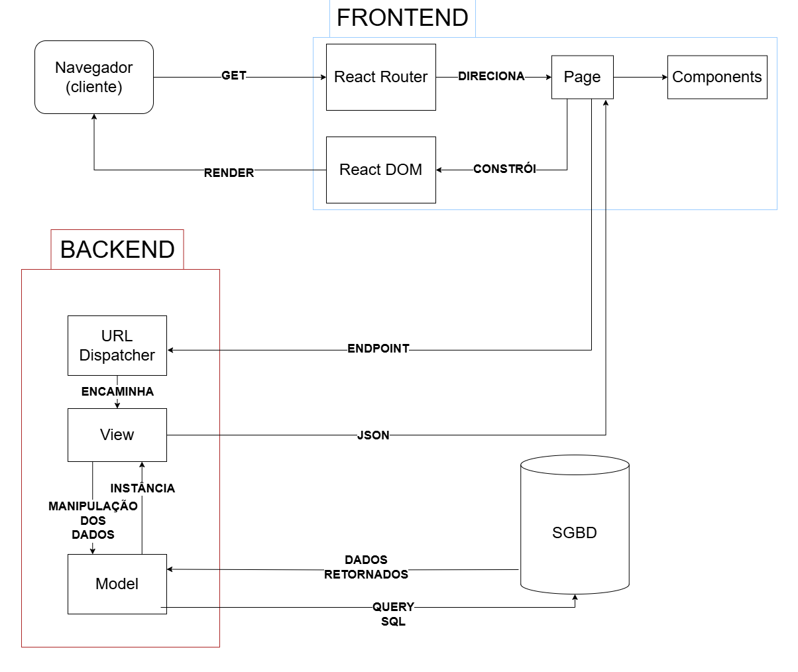
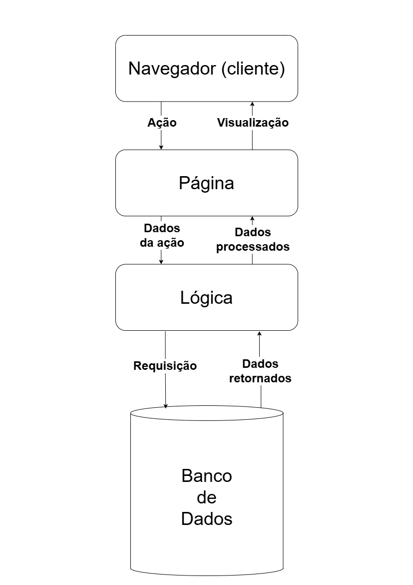

# Projeto Arquitetural do Software

Documento construído a partido do **Modelo BSI - Doc 005 - Documento de Projeto Arquitetual do Software** que pode ser encontrado no
link: https://docs.google.com/document/d/1i80vPaInPi5lSpI7rk4QExnO86iEmrsHBfmYRy6RDSM/edit?usp=sharing

## Descrição da Arquitetura do Projeto

O projeto adota uma arquitetura monolítica, levando em conta seu escopo reduzido, o conhecimento da equipe e os requisitos não-funcionais. Os requisitos RNF02 e RNF03, que demandam alta manutenibilidade e segurança, são adequadamente atendidos por essa abordagem. A escalabilidade não é uma preocupação no contexto atual.

## Visão Geral da Arquitetura

## Arquitetura Simplificada

## Requisitos Não-Funcionais

Encontram-se os requisitos que influenciaram na escolha arquitetural do projeto.

| Código | Nome             | Descrição                                                                                                                                                        |
| :------ | :--------------- | :----------------------------------------------------------------------------------------------------------------------------------------------------------------- |
| RNF02   | Segurança       | Garantir a segurança dos dados dos clientes, por meio de criptografia e controle de acesso.                                                                       |
| RNF03   | Manutenabilidade | Deve ser fácil de manter e atualizar, com um código bem estruturado e documentado, facilitando a correção de erros e implementação de novas funcionalidades. |

## Mecanismos arquiteturais

| Mecanismo de Análise | Mecanismo de Design  | Mecanismo de Implementação |
| -------------------- | -------------------- | -------------------------- |
| Persistência         | Banco de dados relacional | PostgreSQL 15.8      |
| Camada de Dados      | Mapeamento OR             | Django ORM            |
| Frontend  | Interface Usuário | Django Templates, HTML5, JS, React |
| Backend              | REST                  | Django REST Framework     |

# Implantação

A aplicação será implantada utilizando os serviços oferecidos pelo Supabase. A arquitetura da implantação será a seguinte:

- **Banco de Dados**: Supabase PostgreSQL gerenciado, versão 15.8
- **Backend**: Django + Django REST Framework, conectado ao banco do Supabase
- **Frontend**: React JS
- **Armazenamento de arquivos**: Utilização do Supabase Storage para armazenar imagens, documentos e outros arquivos estáticos
- **Autenticação**: Realizada via sistema de autenticação nativo do Supabase

A escolha pelo Supabase se deu pela facilidade de integração com PostgreSQL e seus diversos mecanismos prontos, reduzindo a complexidade da infraestrutura.