```mermaid
classDiagram
direction RL
    class Categoria {
	    - id: int
	    - nome: char
	    +cadastrar_categoria(nome: char) : void
	    +excluir_categoria(id: int) : void
	    +editar_categoria(id: int) : void
	    +pesquisar_categoria(nome: char) : Categoria
	    +relatorio_de_categorias() : ArrayList
	    +get_nome() : char
	    +set_nome(novoNome: char) : void
	    +get_id() : int
    }

    class Cor {
	    - id: int
	    - nome: char
	    +cadastrar_cor(nome: char)
	    +excluir_cor(id: int) void
	    +editar_cor(id: int) void
	    +pesquisar_cor(nome: char) Cor
	    +relatorio_de_cores() ArrayList
	    +get_id() int
	    +get_nome() char
	    +set_nome(novoNome:char) void
    }

    class Capacidade {
	    -id: int
		-quantidade: int
	    -unidade_de_medida: char
	    +cadastrar_capacidade(nome: char) ;
	    +excluir_capacidade(id:int) void
	    +editar_capacidade(id:int) void
	    +pesquisar_medida(nome:char) UnidadeDeMedida
	    +relatorio_de_capacidades() Arraylist
	    +get_id() int
	    +get_nome() char
	    +set_nome(novoNome:char) void
    }


    class Produto {
	    -codigo: int
	    -nome: char
	    -categoria: Categoria
	    -cor: Cor
	    -capacidade: Capacidade
	    +cadastrar_produto(nome: char, codigo: int, categoria: Categoria, cor: Cor, capacidade: Capacidade) void
	    +excluir_produto(codigo: int, nome: char) void
	    +editar_produto(codigo: int, nome: char) void
	    +pesquisar_produto(codigo: int, nome: char) Produto
	    +relatorio_de_produtos() ArrayList
	    +get_codigo() int
	    +get_nome() char
	    +get_categoria() char
	    +get_cor() char
	    +get_unidade_de_medida() char
	    +get_capacidade() int
	    +set_nome(novoNome: char) void
	    +set_categoria(novaCategoria: Categoria) void
	    +set_cor(novaCor: Cor) void
	    +set_capacidade(novaCapacidade: Capacidade) void
    }

    class ProdutosDasVendas {
	    - id: int
	    - venda: Venda
	    - produto: Produto
		+ valor_total() int
	    + get_venda() Venda
	    + get_produto() Produto
	    + calcular_total_venda(valor: double) double
	    + set_venda(novaVenda: Venda) void
	    + set_produto(novoProduto: Produto) void
	    + set_valor(novo_valor: int) void
	    + cad_prods_venda(venda: Venda, produto: Produto)
	    + pesquisar_venda_dos_produtos(produto: Produto) ProdutosDasVendas
    }

    class Venda {
	    - id: int
	    - cliente: Usuario
	    - data_da_venda: Date
	    - quantidade_de_parcelas: int
	    + cadastrar_venda(cliente: Usuario, data_venda: Date, quant_parc: int) void
	    + excluir_venda(id: int, cliente: Usuario) void
	    + pesquisar_venda(id: int, cliente: Usuario) Venda
	    + editar_venda(id: int, cliente: Usuario) void
	    + relatorio_de_vendas() : ArrayList
	    + get_quantidade_de_parcelas() int
	    + calcular_parcelas(valor: double, quant_parce: int) double
	    + cliente_consulta_despesas(cliente: Usuario) ArrayList
    }

    class Usuario {
	    - id: int
	    - tipo: TipoDeUsuario
	    - nome: char
	    - email: char
	    - telefone: char
	    - endereco: Endereco
	    - senha: Password
	    + get_id() int
	    + get_nome() char
	    + get_email() char
	    + set_email(email: char) void
	    + get_telefone() char
	    + set_telefone(telefone: char) void
	    + get_senha() Password
	    + set_senha(senha: Password) void
	    + realizar_login(id: int, senha: Password) void
	    + cadastrar_usuario(nome: char, telefone: char, email: char) void
	    + excluir_usuario(id: int, nome: char) void
	    + pesquisar_usuario(id: int, nome: char) Usuario
	    + editar_usuario(id: int, nome: char) void
	    + relatorio_de_usuarios() ArrayList
    }

    class Endereco {
	    - id: int
	    - numero: char
	    - complemento: char
	    - rua: char
	    + get_nome() char
	    + get_id() int
	    + cadastrar_endereco(id: int, nome: char) void
	    + excluir_endereco(id: int) void
	    + pesquisar_endereco(id: int) Endereco
	    + editar_endereco(id: int) void
	    + relatorio_de_endereco() ArrayList
    }

    class Bairro {
	    - id: int
	    - nome: char
	    + get_nome() char
	    + get_id() int
	    + cadastrar_bairro(id: int, nome: char) void
	    + excluir_bairro(id: int) void
	    + pesquisar_bairro(nome: char) Bairro
	    + editar_bairro(id: int) void
	    + relatorio_de_bairro() ArrayList
    }

    class Cidade {
	    - id: int
	    - nome: char
	    + get_nome() char
	    + get_id() int
	    + cadastrar_cidade(id: int, nome: char) void
	    + excluir_cidade(id: int) void
	    + pesquisar_cidade(nome: char) Cidade
	    + editar_cidade(id: int) void
	    + relatorio_de_cidade() ArrayList
    }

    class Estado {
	    - id: int
	    - nome: char
	    + get_nome() char
	    + get_id() int
	    + cadastrar_estado(id: int, nome: char) void
	    + pesquisar_estado(nome: char) Estado
	    + excluir_estado(id: int) void
	    + editar_estado(id: int) void
	    + relatorio_de_estado() ArrayList
    }

    class TipoDeUsuario {
	    - id: int
	    - tipo: char
	    + cadastrar_cliente(nome: char, telefone: char, email: char) void
	    + excluir_cliente(id: int, nome: char) void
	    + pesquisar_cliente(id: int, nome: char) Cliente
	    + editar_cliente(id: int, nome: char) void
	    + relatorio_de_clientes() ArrayList
    }

    class Consorcio {
	    - id: int
	    - nome: char
	    - data_inicio: Date
	    - data_final: Date
	    + pesquisar_consorcio(nome: char) Consorcio
	    + editar_consorcio(cliente: Cliente, data_final: Date, nome: char) void
    }

    class ParticipacoesDosConsorcios {
	    - id: int
	    - consorcio: Consorcio
	    - cliente: Usuario
	    - data_de_sorteio: Date
	    - cliente_sorteado: Usuario
	    + cliente_consulta_consorcio(cliente: Usuario) consorcio
    }

    class Cobranca {
	    - id: int
	    - venda: Venda
	    - valor_total: double
	    - data_da_cobranca: Date
	    - data_de_vencimento: Date
	    + cadastrar_cobranca(venda: Venda, data_da_cobranca: Date, data_de_vencimento: Date) void
	    + excluir_cobranca(venda: Venda) void
	    + editar_cobranca(id: int) void
	    + relatorio_cobranca() ArrayList
	    + pesquisar_cobranca(venda: Venda) Cobranca
	    + get_valor() double
	    + get_venda() Venda
	    + get_data_da_cobranca() Date
	    + get_data_de_vencimento() Date
	    + valor_restante(pagamentos: Pagamento[]) double
	    + verifica_cobranca(venda: Venda, data_da_cobranca: Date, data_de_vencimento: Date) void
    }

    class Pagamento {
	    - id: int
	    - valor_pago: double
	    - data_pagamento: Date
	    - forma_de_pagamento: char
	    - desconto: double
	    - cobranca: Cobranca
	    + cadastrar_pagamento(data_pagamento: Date, forma_de_pagamento: char, desconto: double, cobranca: Cobranca) void
	    + excluir_pagamento(id: int, venda: Venda) void
	    + editar_pagamento(id: int) void
	    + pesquisar_pagamento(cobranca: Cobranca) Pagamento
	    + relatorio_pagamento() ArrayList
	    + get_data_pagamento() Date
	    + get_estado_de_pagamento() boolean
	    + get_desconto() double
	    + get_acrescimo() double
    }

    Categoria "1" -- "1..*" Produto
    Cor "1" -- "1..*" Produto
    Capacidade "1" -- "1*.." Produto
    Venda "1" -- "1..*" ProdutosDasVendas
    Produto "1" -- "1..*" ProdutosDasVendas
    Usuario "1" -- "1..*" Venda
    Endereco "1" -- "1..*" Usuario
    TipoDeUsuario "1" -- "1..*" Usuario
    Bairro "1" -- "1..*" Endereco
    Cidade "1" -- "1..*" Bairro
    Estado "1" -- "1..*" Cidade
    Usuario "1" -- "1..*" ParticipacoesDosConsorcios
    Consorcio "1" -- "1..*" ParticipacoesDosConsorcios
    Venda "1" -- "1..*" Cobranca
    Cobranca "1" -- "0..*" Pagamento
```

## Contagem Indicativa

| Função de Dado             | Entidades Relacionadas                         | Tamanho em PF |
| -------------------------- | ---------------------------------------------- | :-----------: |
| ALI Categoria              | Categoria                                      |     35 PF     |
| ALI Cor                    | Cor                                            |     35 PF     |
| ALI Capacidade             | Capacidade                                     |     35 PF     |
| ALI Produto                | Produto, Categoria, Cor, Capacidade            |     35 PF     |
| ALI ProdutosDasVendas      | ProdutosDasVendas, Produto, Venda              |     35 PF     |
| ALI Venda                  | Venda, Usuario                                 |     35 PF     |
| ALI Usuario                | Usuario, TipoDeUsuario, Endereco               |     35 PF     |
| ALI Endereco               | Endereco                                       |     35 PF     |
| ALI Bairro                 | Bairro                                         |     35 PF     |
| ALI Cidade                 | Cidade                                         |     35 PF     |
| ALI Estado                 | Estado                                         |     35 PF     |
| ALI TipoDeUsuario          | TipoDeUsuario                                  |     35 PF     |
| ALI Consorcio              | Consorcio                                      |     35 PF     |
| ALI ParticipacoesConsorcio | ParticipacoesDosConsorcios, Consorcio, Usuario |     35 PF     |
| ALI Cobranca               | Cobranca, Venda                                |     35 PF     |
| ALI Pagamento              | Pagamento, Cobranca                            |     35 PF     |
| **Total**                  | **16 ALIs**                                    |  **560 PF**   |

## Contagem Estimativa

| Função de Dado                        | Tipo | RLR | DER | Complexidade | Tamanho em PF |
| ------------------------------------- | ---- | --- | --- | ------------ | ------------- |
| Categoria                             | ALI  | 1   | 2   | Baixa        | 7 PF          |
| Cor                                   | ALI  | 1   | 2   | Baixa        | 7 PF          |
| Capacidade                            | ALI  | 1   | 3   | Baixa        | 7 PF          |
| Produto                               | ALI  | 4   | 5   | Baixa        | 7 PF          |
| ProdutosDasVendas                     | ALI  | 3   | 3   | Baixa        | 7 PF          |
| Venda                                 | ALI  | 2   | 4   | Baixa        | 7 PF          |
| Usuario                               | ALI  | 3   | 7   | Baixa        | 7 PF          |
| Endereco                              | ALI  | 1   | 4   | Baixa        | 7 PF          |
| Bairro                                | ALI  | 1   | 2   | Baixa        | 7 PF          |
| Cidade                                | ALI  | 1   | 2   | Baixa        | 7 PF          |
| Estado                                | ALI  | 1   | 2   | Baixa        | 7 PF          |
| TipoDeUsuario                         | ALI  | 1   | 2   | Baixa        | 7 PF          |
| Consorcio                             | ALI  | 1   | 4   | Baixa        | 7 PF          |
| ParticipacoesConsorcio                | ALI  | 3   | 5   | Baixa        | 7 PF          |
| Cobranca                              | ALI  | 2   | 5   | Baixa        | 7 PF          |
| Pagamento                             | ALI  | 2   | 6   | Baixa        | 7 PF          |
| **Total**                             |      |     |     |              | **112 PF**    |
| Função de Dado                        | Tipo | RLR | DER | Complexidade | Tamanho em PF |
| RF01 - Inserir Categoria              | EE   | 1   | 2   | Baixa        | 3 PF          |
| RF02 - Editar Categoria               | EE   | 1   | 2   | Baixa        | 3 PF          |
| RF03 - Excluir Categoria              | EE   | 1   | 2   | Baixa        | 3 PF          |
| RF04 - Pesquisar Categoria            | CE   | 1   | 2   | Baixa        | 3 PF          |
| RF01 - Inserir Cor                    | EE   | 1   | 2   | Baixa        | 3 PF          |
| RF02 - Editar Cor                     | EE   | 1   | 2   | Baixa        | 3 PF          |
| RF03 - Excluir Cor                    | EE   | 1   | 2   | Baixa        | 3 PF          |
| RF04 - Pesquisar Cor                  | CE   | 1   | 2   | Baixa        | 3 PF          |
| RF01 - Inserir Capacidade             | EE   | 1   | 3   | Baixa        | 3 PF          |
| RF02 - Editar Capacidade              | EE   | 1   | 3   | Baixa        | 3 PF          |
| RF03 - Excluir Capacidade             | EE   | 1   | 3   | Baixa        | 3 PF          |
| RF04 - Pesquisar Capacidade           | CE   | 1   | 3   | Baixa        | 3 PF          |
| RF01 - Inserir Produto                | EE   | 4   | 5   | Baixa        | 3 PF          |
| RF02 - Editar Produto                 | EE   | 4   | 5   | Baixa        | 3 PF          |
| RF03 - Excluir Produto                | EE   | 4   | 5   | Baixa        | 3 PF          |
| RF04 - Pesquisar Produto              | CE   | 4   | 5   | Baixa        | 3 PF          |
| RF01 - Inserir ProdutosDasVendas      | EE   | 2   | 3   | Baixa        | 3 PF          |
| RF01 - Inserir Venda                  | EE   | 2   | 4   | Baixa        | 3 PF          |
| RF02 - Editar Venda                   | EE   | 2   | 4   | Baixa        | 3 PF          |
| RF03 - Excluir Venda                  | EE   | 2   | 4   | Baixa        | 3 PF          |
| RF04 - Pesquisar Venda                | CE   | 2   | 4   | Baixa        | 3 PF          |
| RF01 - Inserir Usuario                | EE   | 3   | 7   | Baixa        | 3 PF          |
| RF02 - Editar Usuario                 | EE   | 3   | 7   | Baixa        | 3 PF          |
| RF03 - Excluir Usuario                | EE   | 3   | 7   | Baixa        | 3 PF          |
| RF04 - Pesquisar Usuario              | CE   | 3   | 7   | Baixa        | 3 PF          |
| RF01 - Inserir Endereco               | EE   | 1   | 4   | Baixa        | 3 PF          |
| RF02 - Editar Endereco                | EE   | 1   | 4   | Baixa        | 3 PF          |
| RF03 - Excluir Endereco               | EE   | 1   | 4   | Baixa        | 3 PF          |
| RF04 - Pesquisar Endereco             | CE   | 1   | 4   | Baixa        | 3 PF          |
| RF01 - Inserir Bairro                 | EE   | 1   | 2   | Baixa        | 3 PF          |
| RF02 - Editar Bairro                  | EE   | 1   | 2   | Baixa        | 3 PF          |
| RF03 - Excluir Bairro                 | EE   | 1   | 2   | Baixa        | 3 PF          |
| RF04 - Pesquisar Bairro               | CE   | 1   | 2   | Baixa        | 3 PF          |
| RF01 - Inserir Cidade                 | EE   | 1   | 2   | Baixa        | 3 PF          |
| RF02 - Editar Cidade                  | EE   | 1   | 2   | Baixa        | 3 PF          |
| RF03 - Excluir Cidade                 | EE   | 1   | 2   | Baixa        | 3 PF          |
| RF04 - Pesquisar Cidade               | CE   | 1   | 2   | Baixa        | 3 PF          |
| RF01 - Inserir Estado                 | EE   | 1   | 2   | Baixa        | 3 PF          |
| RF02 - Editar Estado                  | EE   | 1   | 2   | Baixa        | 3 PF          |
| RF03 - Excluir Estado                 | EE   | 1   | 2   | Baixa        | 3 PF          |
| RF04 - Pesquisar Estado               | CE   | 1   | 2   | Baixa        | 3 PF          |
| RF01 - Inserir TipoDeUsuario          | EE   | 1   | 2   | Baixa        | 3 PF          |
| RF02 - Editar TipoDeUsuario           | EE   | 1   | 2   | Baixa        | 3 PF          |
| RF03 - Excluir TipoDeUsuario          | EE   | 1   | 2   | Baixa        | 3 PF          |
| RF04 - Pesquisar TipoDeUsuario        | CE   | 1   | 2   | Baixa        | 3 PF          |
| RF01 - Inserir Consorcio              | EE   | 1   | 4   | Baixa        | 3 PF          |
| RF02 - Editar Consorcio               | EE   | 1   | 4   | Baixa        | 3 PF          |
| RF03 - Excluir Consorcio              | EE   | 1   | 4   | Baixa        | 3 PF          |
| RF04 - Pesquisar Consorcio            | CE   | 1   | 4   | Baixa        | 3 PF          |
| RF01 - Inserir ParticipacoesConsorcio | EE   | 3   | 5   | Baixa        | 3 PF          |
| RF01 - Inserir Cobranca               | EE   | 2   | 5   | Baixa        | 3 PF          |
| RF02 - Editar Cobranca                | EE   | 2   | 5   | Baixa        | 3 PF          |
| RF03 - Excluir Cobranca               | EE   | 2   | 5   | Baixa        | 3 PF          |
| RF04 - Pesquisar Cobranca             | CE   | 2   | 5   | Baixa        | 3 PF          |
| RF01 - Inserir Pagamento              | EE   | 2   | 6   | Baixa        | 3 PF          |
| RF02 - Editar Pagamento               | EE   | 2   | 6   | Baixa        | 3 PF          |
| RF04 - Pesquisar Pagamento            | CE   | 2   | 6   | Baixa        | 3 PF          |
